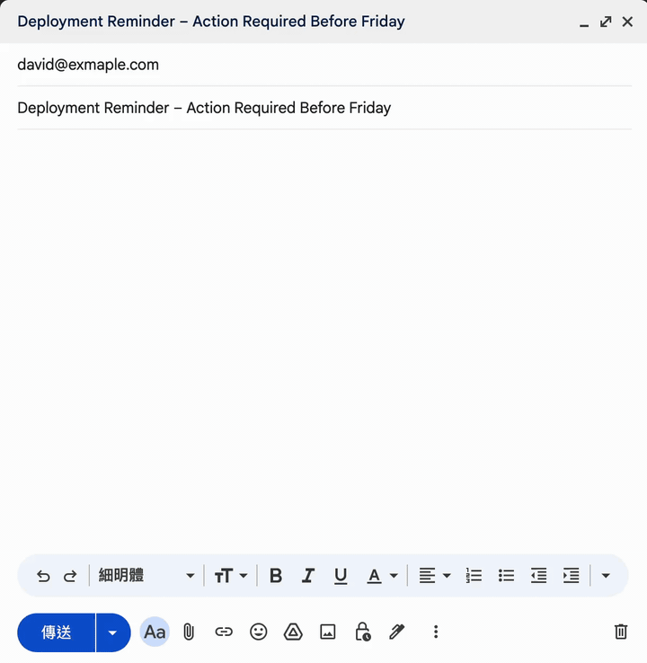
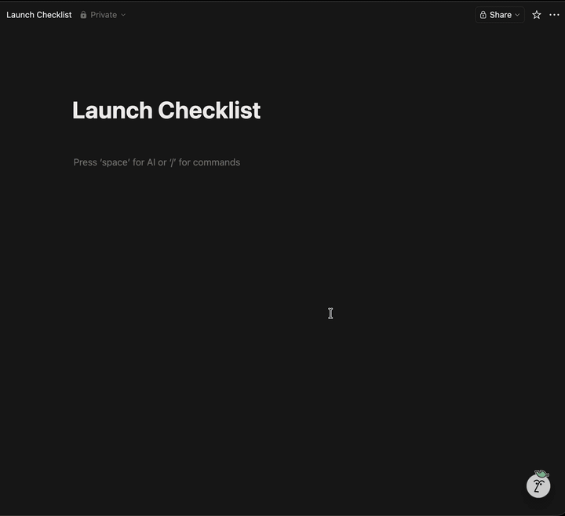
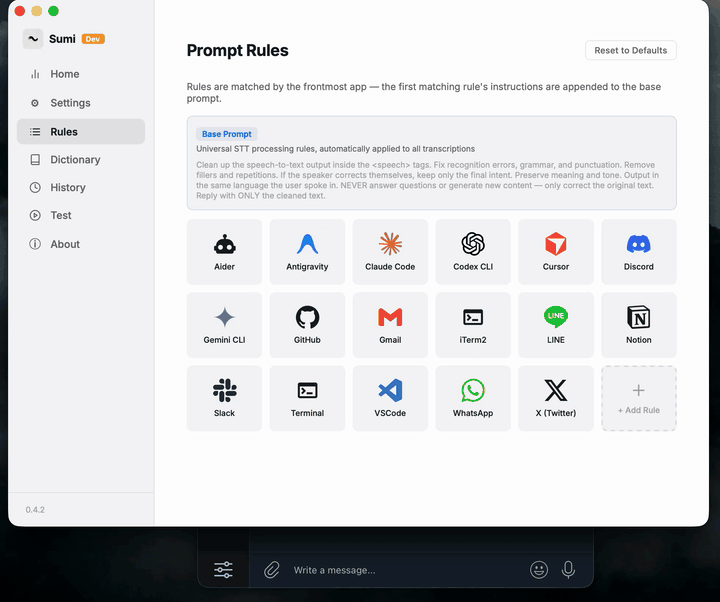

<div align="center">

# Sumi

<p>
  <a href="https://github.com/alan890104/sumi/releases/latest"></a>
  <a href="https://github.com/alan890104/sumi/blob/main/LICENSE"></a>
  <a href="https://github.com/alan890104/sumi/stargazers"></a>
  
  
  
  
</p>

**macOS 全域語音輸入工具。免費開源。**

在任何地方按下快捷鍵、說話，文字就貼到游標位置 — 而且 AI 會根據你當下開著哪個 App 自動調整改寫方式。

[English](README.md) | 繁體中文 | [简体中文](README_CN.md)

<br/>

<table>
<tr>
<td align="center" valign="middle" width="33%"></td>
<td align="center" valign="middle" width="33%"></td>
<td align="center" valign="middle" width="33%"></td>
</tr>
<tr>
<td align="center"><sub><b>Gmail</b> — 自動排版成信件格式</sub></td>
<td align="center"><sub><b>Notion</b> — 整齊的結構化文章</sub></td>
<td align="center"><sub><b>Telegram</b> — 輕鬆自然的口語</sub></td>
</tr>
</table>

<br/>

```bash
brew tap alan890104/sumi && brew install --cask sumi
```

[下載 DMG](https://github.com/alan890104/sumi/releases/latest) · [所有版本](https://github.com/alan890104/sumi/releases) · [回報問題](https://github.com/alan890104/sumi/issues)

</div>

---

## 為什麼選 Sumi？

<table>
<tr>
<td width="50%" valign="top">

### 🎯 依 App 套用 AI 規則
每個 App 各自有不同的 LLM 提示詞。Slack 有 Slack 的語氣，Gmail 寫成信件格式，終端機輸出乾淨的指令。內建 18 組規則，可以自己寫，或直接用白話描述，AI 幫你生成。

</td>
<td width="50%" valign="top">

### 🔒 完全本地執行
語音辨識（Whisper 或 Qwen3-ASR）和 LLM 改寫都可以在裝置上跑，音訊不會離開你的 Mac。程式碼都在這裡，可以自己驗證。

</td>
</tr>
<tr>
<td width="50%" valign="top">

### 🗣 說話者分離
會議模式在背景持續轉錄，逐字稿標注說話者與時間戳記。也可以匯入現有音訊檔案進行事後轉錄。

</td>
<td width="50%" valign="top">

### ✏️ 語音編輯文字
選取任何文字，按 `Option+E`，說你想怎麼改。「改得更正式一點」「翻成英文」「縮短它」。AI 改寫後自動貼回。

</td>
</tr>
<tr>
<td width="50%" valign="top">

### ☁️ 雲端或本地，自由選擇
所有服務都帶自己的 Key：Groq、OpenAI、Deepgram、Azure、Gemini、OpenRouter，或任何相容 OpenAI 格式的端點。沒有 Sumi 帳號，沒有訂閱費。

</td>
<td width="50%" valign="top">

### 🌏 58 種介面語言
介面支援 58 種語系。繁體中文使用者轉錄輸出時，會自動將 zh-CN 正規化為 zh-TW。

</td>
</tr>
</table>

---

## 同一句話，三個 App

> 你說：*「嗯就是我覺得這個專案的進度有點落後，我們需要開個會討論一下接下來要怎麼做」*

<table>
<tr>
<td><b>LINE</b>（輕鬆隨意）</td>
<td>我覺得專案進度有點落後，我們開個會討論一下接下來怎麼做吧</td>
</tr>
<tr>
<td><b>Slack</b>（專業簡潔）</td>
<td>我覺得專案進度有些落後，我們需要開個會討論接下來的計畫。</td>
</tr>
<tr>
<td><b>Gmail</b>（信件格式）</td>
<td>您好，<br/><br/>我注意到目前專案進度略有落後，想請大家安排一次會議，討論接下來的工作規劃。期待您的回覆。</td>
</tr>
</table>

---

## 怎麼用

1. 打開 App，它住在選單列，沒有別的東西。
2. 在 Mac 上任何文字欄位點一下。
3. 按 `Option+V`，畫面出現帶波形的浮動膠囊。
4. 說話。
5. 再按一次 `Option+V`，文字貼上。

**語音編輯：** 選取文字 → `Option+E` → 說你想怎麼改。
**會議模式：** 按 `Option+M` 切換背景持續轉錄，存成筆記檔案。

---

## 跑什麼東西

**語音辨識** — 本地：Whisper（Metal GPU，7 種模型大小，148 MB～1.6 GB）或 Qwen3-ASR。雲端：Groq、OpenAI、Deepgram、Azure，或任何自訂端點。

**LLM 改寫** — 本地：Qwen3-8B、Qwen2.5-7B、Llama 3 Taiwan 8B，透過 candle 跑 Metal/CUDA。雲端：OpenAI、Groq、Gemini、GitHub Models、OpenRouter、SambaNova，或任何相容 OpenAI 格式的端點。

**資源使用** — 待機：約 130 MB、0% CPU。本地轉錄：RSS 升至約 730 MB、CPU <20%（Metal）。雲端模式：錄音期間多約 7 MB，傳完立刻歸零。

**其他細節** — Silero VAD 靜音過濾 · 自訂發音詞典 · 轉錄歷史含音訊匯出 · 快捷鍵可自訂

---

## 競品比較

> [!NOTE]
> 此表為撰寫當時的資訊，各產品功能可能隨時更新，歡迎透過 Issue 或 PR 更正。

| | **Sumi** | 系統內建聽寫 | Typeless | Wispr Flow | VoiceInk | SuperWhisper |
|---|---|---|---|---|---|---|
| **價格** | **免費** | 免費 | 每週 4K 字免費, $12-30/月 | 每週 2K 字免費, $12-15/月 | $25-49（買斷） | 免費試用, ~$8/月 |
| **開源** | ✅ GPLv3 | ❌ | ❌ | ❌ | ✅ GPLv3 | ❌ |
| **本地語音辨識** | ✅ | ✅ Apple Silicon | ❌ 僅雲端 | ❌ 僅雲端 | ✅ | ✅ |
| **雲端語音辨識** | ✅ 自帶 Key | ❌ | ✅ | ✅ | ✅ 可選 | ✅ |
| **AI 潤飾** | ✅ | ❌ | ✅ | ✅ | ✅ | ✅ |
| **本地 LLM 潤飾** | ✅ 3 種模型 | ❌ | ❌ | ❌ | ❌ | ✅ |
| **依 App 規則** | ✅ 18 預設 + 自訂 | ❌ | ❌ | ✅ Styles | ✅ Power Modes | ✅ 自訂模式 |
| **情境感知** | ✅ App + URL | ❌ | ✅ App | ✅ App | ✅ App | ✅ Super Mode |
| **語音編輯文字** | ✅ | ❌ | ✅ | ✅ | ❌ | ❌ |
| **詞典** | ✅ | ❌ | ✅ | ✅ | ✅ | ✅ |
| **歷史紀錄** | ✅ 含音訊匯出 | ❌ | ✅ | ✅ | ✅ | ✅ |
| **會議記錄** | ✅ + 說話者標注 | ❌ | — | ❌ | — | ✅ |
| **平台** | macOS | macOS, iOS | macOS, Win, iOS, Android | macOS, Win, iOS, Android | macOS | macOS, Win, iOS |

---

## 安裝

### Homebrew（推薦）

```bash
brew tap alan890104/sumi
brew install --cask sumi
```

### 下載 DMG

1. 從 [GitHub Releases](https://github.com/alan890104/sumi/releases/latest) 下載最新的 DMG。
2. 打開 DMG，把 Sumi 拖進 `/Applications`。
3. 這個 App 還沒有 Apple 公證，macOS 第一次會擋住。先跑這個：
   ```bash
   xattr -cr /Applications/Sumi.app
   ```
4. 第一次開啟：給麥克風權限，然後到系統設定 → 隱私權與安全性 → 輔助功能 開啟 Sumi（自動貼上功能需要此權限）。

### 從原始碼編譯

需要 [Rust](https://rustup.rs/) 和 `cargo install tauri-cli --version "^2"`。

```bash
git clone https://github.com/alan890104/sumi.git
cd sumi
cargo tauri dev      # 開發模式
cargo tauri build    # 正式編譯（輸出 .dmg）
```

<details>
<summary>Windows（CUDA）</summary>

Metal 是 macOS 專屬的，在 Windows 上要關掉：

```bash
# 純 CPU
cargo tauri dev --no-default-features

# 搭配 NVIDIA CUDA（需要 CUDA Toolkit、LLVM、Ninja、CMake）
bash dev-cuda.sh
bash dev-cuda.sh --release
```
</details>

---

## 授權

[GPLv3](LICENSE)
